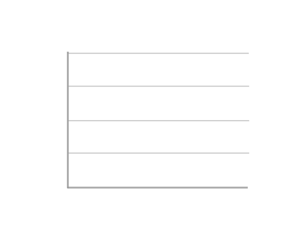

<h1> Assalamualaikum, I'm  <a href="https://mahamadayaz.site">Mahamadayaz 👋</a> </h1>

<h3><a href="https://mahamadayazmomin.site">Mobile App Developer </a></h3> 

-   📱 I’m currently working on Mobile App Development 
-   🚀 I’m learning Android Development & Flutter
-   👯 I’m looking to collaborate on Mobile App Development Projects
-    Ask me about Flutter, Dart, Java, Android, Firebase & Mobile UI/UX
-   ❤️ I’m passionate about Building Beautiful & High-Performance Mobile Apps
-   💻 I enjoy learning new technologies & sharing knowledge with the community
-   ⚡ Fun fact: I can type at 90+ WPM and love turning ideas into mobile apps!

<!-- education section starts here  -->
## Education

| **Degree**                                    | **Institution**                               | **Location**         |
|-----------------------------------------------|-----------------------------------------------|----------------------|
| Bachelor of Engineering                       | Visvesvaraya Technological University (VTU)   | Belagavi, India      |
<!-- education section ends here  -->

##     Connect with me!  

##  Mahamadayaz's Github Stats 

|  |  |
| --------------------------------------------------------------------------------------------------------------------------------------------------------------------------------------------------------------------------- | --------------------------------------------------------------------------------------------------------------------------------------------------------------------------------------------------------------- |

 
<b>📓 Notes:</b> <i>Top languages is only a metric of the languages my public code consists of and doesn't reflect experience or skill level.</i>
 

<!--  -->

Thanks for going through My Portfolio. All rights reserved by Mahamadayaz @2026

<!--  -->
